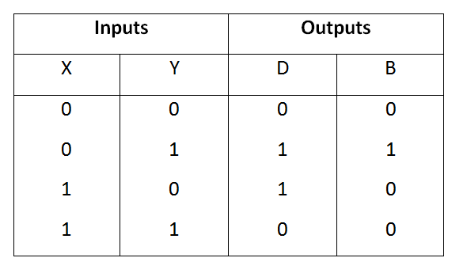
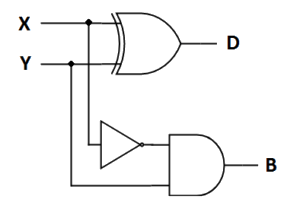
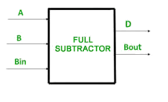
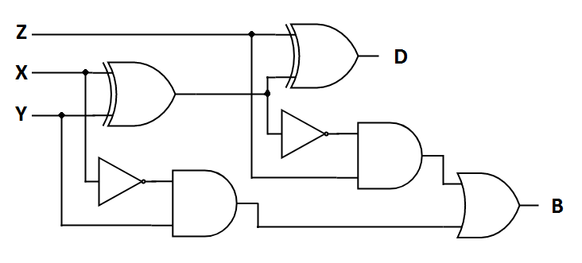

### Introduction

Subtractor circuits take two binary numbers as input and subtract one binary number input from the other binary number input. Similar to adders, it gives out two outputs, difference and borrow (carry-in the case of Adder). There are two types of subtractors.   
1) Half Subtractor 
2) Full Subtractor
                     

###  1) Half Subtractor
The half-subtractor is a combinational circuit which is used to perform subtraction of two bits. It has two inputs, X (minuend) and Y (subtrahend) and two outputs D (difference) and B (borrow). The logic symbol and truth table are shown below.
 

   <b>Figure-1:Logic Symbol of Half subtractor</b> 
      
   <b>Figure-2:Truth Table of Half subtractor</b>
 
 

  
      
<b>Figure-3:Circuit Diagram of Half subtractor</b>
 
 

From the above truth table we can find the boolean expression. 

<b>D = X ⊕ Y 
B = X' Y  </b>

From the equation we can draw the half-subtractor circuit as shown in the figure 3. 

### 2) Full Subtractor
A full subtractor is a combinational circuit that performs subtraction involving three bits, namely minuend, subtrahend, and borrow-in . It accepts three inputs: minuend, subtrahend and a borrow bit and it produces two outputs: difference and borrow. The logic symbol and truth table are shown below.  
        

  <b>Figure-4:Logic Symbol of Full subtractor</b> 
  Figure-5:Truth Table of Full subtractor</b>

  
      

From the above truth table we can find the boolean expression. 

<b>D = A ⊕ B ⊕ Bin 
B = A' Bin + A' B + B Bin  </b>

From the equation we can draw the Full-subtractor circuit as shown in the figure 6.
 

  <b>Figure-6:Circuit Diagram of Full subtractor</b>
 

