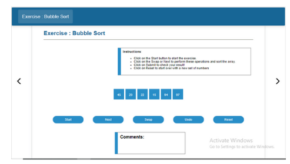

### This folder contains storyboard used in the documentation.

# Storyboarding for Bubble Sort Experiment

## 1. Story Outline: 
The user approaches the simulator to understand the concept of the Bubble Sort algorithm. The user works on an array of unsorted numbers wherein he has the facility to click on buttons to perform the primitive actions (join/split, compare). The user clicks these buttons and studies how these primitive actions are used in order to realize the properties of the Merge sort algorithm. The user uses the exercise simulator wherein he can practice performing this experiment and verify his results.

## 2. Story:
### 2.1 Set the Visual Stage Description:
When the user lands on the simulator page, a set of three simulators options is displayed to click on – Demo, Practice and Experiment.
Demo – Instructions regarding how to perform the demo are displayed in a box at the top. An array of unsorted numbers is displayed below along with the set of buttons Start, Reset and Pause to perform those functions. A slider too is displayed in order to adjust the speed of the execution of the demo.
Practice - Instructions regarding how to use the practice simulator are displayed in a box at the top. An array of unsorted numbers is displayed below along with the set of buttons Next, Swap and Reset to perform those functions. A comments box is displayed below the buttons.
Exercise - Instructions regarding how to use the exercise simulator are displayed in a box at the top along with a question to be solved. An array of unsorted numbers is displayed below along with the set of buttons Start, Next, Swap, Undo and Reset.

### 2.2 Set User Objectives & Goals:
The learning objectives are framed such that the higher cognitive levels of Bloom’s taxonomy are addressed.
| Learning Objectives  |Cognitive Level|
|----------------------| --------------|
| Compare Bubble Sort with other sorting algorithms and realise Bubble sort as a stable comparison sorting algorithm.  |Analyse |
|  Students will be able to apply Bubble sort algorithm using the simulator to  sort numbers | Apply  |

### 2.3 Set the pathway activities:
There are three types of simulators used for the Bubble Sort:

* Demo
* Practice
* Exercise

a) Demo:
   1. Allow the user to click the Start button.
   2. Allow the user to adjust the speed of the demo according to convenience.
   3. Colour the nodes being compared.
   4. Allow the user to pause the execution and resume.
   5. When the user clicks the Reset button, the demo must return back to its initial state.
   
b) Practice:
   1. Allow the user to click the Next and the Swap buttons according to whichever function is required.
   2. If the Swap button is clicked, swap the two elements being compared.
   3. When the user clicks Next, the simulator must compare the next pair of elements in the array.
   4. Colour the nodes being compared.
   5. Display appropriate comments for the actions performed by the user.
   6. When the user clicks the Reset button, the execution must return back to its initial state.

c) Exercise:

   1. Allow the user to enter values in the ‘Difference’ and ‘Iterations’ fields according to the question given.
   2. Allow the user to click on the Run an Iteration button to perform the function.
   3. Colour the node being compared.
   4. Allow the user to click Submit to check if his sort is correct.
   5. When the user clicks the Reset button, the execution must return back to its initial state.

**NOTE** : For Optimized Bubble Sort, colour the already sorted nodes in the iteration grey.

### 2.4 Set Challenges and Questions/Complexity/Variations in Questions:
Q1. The number of swaps needed to sort the numbers 27, 61, 82, 64, 27, 62 in non-decreasing order, using bubble sort is :
   1. 8
   2. 7
   3. 6
   4. 5
Q2. What is the best case time complexity of bubble sort?
   1. O(N)
   2. O(N^2)
   3. O(N^3)
   4. Cannot be determined

Q3. How many iterations of bubble sort (can be slightly modified) will it take to determine if an array with N elements is "ALMOST" sorted (elements are at max one position away from their correct places)?
   1. 1
   2. 2
   3. N
   4. Insufficient information

Q4.  What is the worst case scenario for bubble sort?
   1. Reverse sorted array
   2. Sorted array
   3. Smallest element in last position
   4. Largest element in first position
   5. A, C

Q5. Can you modify bubble sort to find the kth smallest element?
  1. Yes, in K iterations
  2. Yes, in (N-K) iterations
  3. No
  4. Insufficient information
  5. A, B

### 2.5 Allow pitfalls:

  1. In the exercise simulator, when a user performs the wrong step according to the algorithm, the final result will not be the desired outcome.
  2. In the exercise simulator of regular Bubble Sort, if the user clicks on the Submit button as soon as the array is sorted but before the number of required iterations are not completed, then the result will turn out to be wrong.

### 2.6 Conclusion:
  1. Assessment/evaluation of the pre-test and post-test should be given immediately to the user. The moment the student clicks on the ‘Submit’   button, the CORRECT answers should be displayed below the question. This would enable the student to understand whether he is right or wrong then and there itself.
  2. This would notify the users on how many answers were correctly answered.
  3. Marks may be assigned to each question which would enable the student to calculate his performance feedback.
  4. The pre-test and the post-test take up 10 minutes each. Along with the learning modules, the total time required to perform the experiment will be about 1 hour.

## 3. Flowchart: 

  

## 4. MindMap: 

  

## 5. Storyboard:

  

  

  

